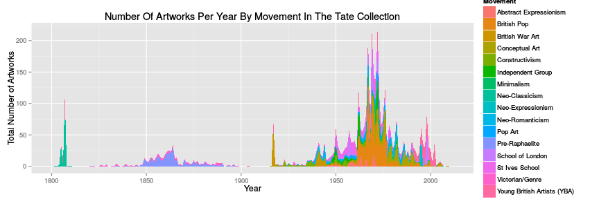
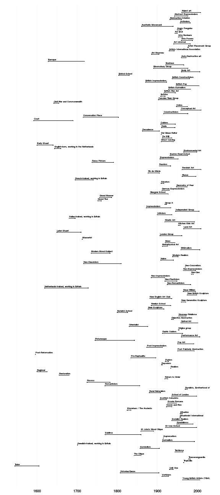
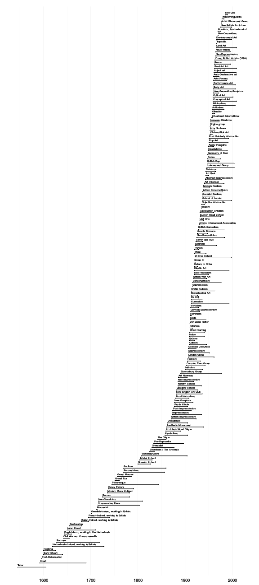
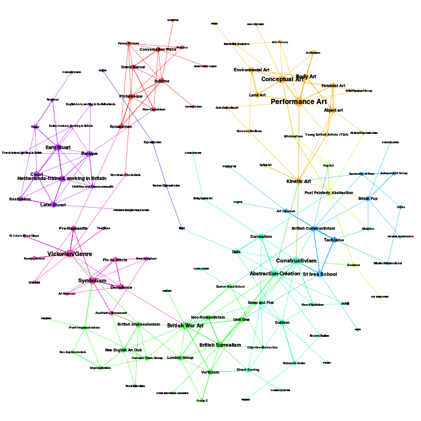

Exploring Tate Art Open Data 2
================================================================================

This is the second in a series of posts examining Tate's excellent collection dataset. The R and R Markdown code for this series is available at [https://gitorious.org/robmyers/tate-data-r/](https://gitorious.org/robmyers/tate-data-r/) .

As before, let's get started by loading the data.


```r
source("../r/load_tate_data.r")
```


Movement Artwork Counts
--------------------------------------------------------------------------------

Next let's load some code to visualize the number of artworks in the collection categorized as being produced by a particular movement each year.


```r
source("../r/movement_artwork_counts.r")
```

```
## Loading required package: methods
```


You can see the code in the Git repository above. It loads the Tate collection data files and declares some functions that we can use to plot movement artwork counts.

We can plot the number of artworks from a given movement, for example the Young British Artists (YBAs):


```r
plotMovementFrequency("Young British Artists (YBA)")
```

 


Or we can plot the combined counts for multiple movements, for example those since 1800:


```r
plotArtworkCountsByYear()
```

 


These figures are available as PDFs in the Git repository.

Movement Durations
--------------------------------------------------------------------------------

When did a movement start and end, and how long did it last? We can plot this for movements as defined by the date of production of the artworks labelled as being part of that movement in the Tate collection.


```r
source("../r/movement_durations.r")
```


First by movement name:


```r
plotMovementDurations(movement.durations.alpha, movement.order.alpha)
```

 


And then by movement start date:


```r
plotMovementDurations(movement.durations.from, movement.order.from)
```

 


These figures are also available as PDFs in the Git repository.

Movement Influences
--------------------------------------------------------------------------------

We can use artists who are in two or more movements as links between movements, constructing a network graph of social connections between movements. 


```
## Warning: At structural_properties.c:1847 :igraph_subgraph is deprecated
## from igraph 0.6, use igraph_induced_subgraph instead
```

Like the Wikipedia data-based update of Alfred Barr's handmade diagram for the MoMA Cubism & Abstract Art exhibition of 1936 [Collectivizing The Barr Model](http://ahcncompanion.info/abstract/collectivizing-the-barr-model/) we can extract a family tree (or Rhizome) of influence between art movements and otherwise use network analysis methods to study the social network of art movements:


```r
plotMovementArtistLinks()
```

 


Again, this figure is also available as PDFs in the Git repository.

Conclusions
--------------------------------------------------------------------------------

As you can see some of these graphics work better as posters or large-scale PDFs than as bitmaps. There's much that could be done with curve fitting and comparison of movement artwork counts. And all the techniques of social network analysis can be applied to the graph of artists and movements.

Next we'll look at artwork genres, which are not explicitly labelled in the collection dataset.
